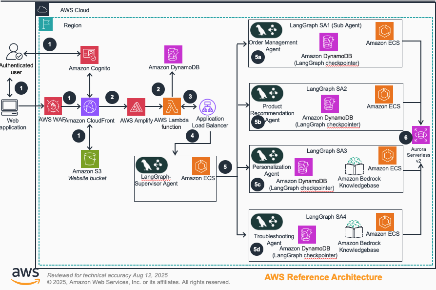

# Guidance for Multi-Agent Orchestration using LangGraph on AWS

## Table of Contents

1. [Overview](#overview)
    - [Cost](#cost)
2. [Prerequisites](#prerequisites)
    - [Operating System](#operating-system)
3. [Deployment Steps](#deployment-steps)
4. [Deployment Validation](#deployment-validation)
5. [Running the Guidance](#running-the-guidance)
6. [Next Steps](#next-steps)
7. [Cleanup](#cleanup)

## Overview

This Guidance demonstrates how to build and deploy a scalable multi-agent customer support system using LangGraph and AWS services. The solution orchestrates multiple specialized AI agents that collaborate to handle complex customer inquiries, from order management to product recommendations and technical troubleshooting.

**Why did we build this Guidance?**
Traditional single-agent AI systems often struggle with complex, multi-faceted customer support scenarios that require specialized knowledge across different domains. This Guidance solves this problem by implementing a supervisor-agent pattern where a central orchestrator coordinates multiple specialized agents, each optimized for specific tasks.

**What problem does this Guidance solve?**
- Eliminates the need for customers to navigate multiple support channels
- Provides consistent, personalized support experiences across different inquiry types
- Scales customer support operations while maintaining quality and context
- Demonstrates enterprise-grade multi-agent orchestration patterns on AWS



### Architecture Flow

1. **User Interface**: React-based frontend hosted on Amazon S3 and distributed via CloudFront, with authentication through Amazon Cognito
2. **API Layer**: AWS AppSync GraphQL API provides real-time streaming capabilities for chat interactions
3. **Agent Orchestration**: Supervisor agent running on Amazon ECS Fargate coordinates with specialized sub-agents
4. **Specialized Agents**: Five containerized agents handle specific domains:
   - **Supervisor Agent**: Central orchestrator and conversation manager
   - **Order Management Agent**: Handles order tracking, returns, and inventory queries
   - **Product Recommendation Agent**: Provides personalized product suggestions
   - **Personalization Agent**: Manages customer profiles and preferences
   - **Troubleshooting Agent**: Resolves technical issues and provides support guidance
5. **Data Layer**: Amazon Aurora PostgreSQL for structured data, Amazon Bedrock Knowledge Base for unstructured data
6. **AI/ML Services**: Amazon Bedrock with Claude 3.5 Haiku cross-region inference for natural language processing and reasoning
7. **Monitoring**: Amazon CloudWatch for comprehensive observability across all components

### Cost

_You are responsible for the cost of the AWS services used while running this Guidance. As of January 2025, the cost for running this Guidance with the default settings in the US East (N. Virginia) region is approximately $245.50 per month for processing 10,000 customer interactions._

_We recommend creating a [Budget](https://docs.aws.amazon.com/cost-management/latest/userguide/budgets-managing-costs.html) through [AWS Cost Explorer](https://aws.amazon.com/aws-cost-management/aws-cost-explorer/) to help manage costs. Prices are subject to change. For full details, refer to the pricing webpage for each AWS service used in this Guidance._

### Sample Cost Table

The following table provides a sample cost breakdown for deploying this Guidance with the default parameters in the US East (N. Virginia) Region for one month.

| AWS service                        | Dimensions                                       | Cost [USD]  |
| ---------------------------------- | ------------------------------------------------ | ----------- |
| Amazon ECS Fargate                 | 5 agents × 0.5 vCPU × 1GB RAM × 24/7             | $54.00      |
| Amazon Aurora Serverless v2        | 0.5-4 ACUs, 7-day backup retention               | $45.00      |
| Amazon Bedrock (Claude 3.5 Sonnet) | 10,000 requests × 1,500 tokens avg               | $75.00      |
| Amazon Bedrock Knowledge Base      | 4 knowledge bases, 2GB data, 2,000 queries       | $35.00      |
| AWS AppSync                        | 10,000 GraphQL requests, real-time subscriptions | $15.00      |
| Amazon Cognito                     | 1,000 active users per month                     | $0.00       |
| Amazon S3                          | 5GB storage, 50,000 requests                     | $2.50       |
| Amazon CloudFront                  | 10GB data transfer, 100,000 requests             | $8.00       |
| Application Load Balancer          | 1 ALB, 10GB processed data                       | $18.00      |
| Amazon CloudWatch                  | Logs, metrics, and monitoring                    | $12.00      |
| **Total**                          |                                                  | **$264.50** |

## Prerequisites

### Operating System

These deployment instructions are optimized to best work on **Amazon Linux 2023 AMI**, **macOS**, or **Ubuntu 20.04+**. Deployment on other operating systems may require additional steps.

**Required tools:**
- AWS CLI v2.0+ ([installation guide](https://docs.aws.amazon.com/cli/latest/userguide/getting-started-install.html))
- AWS CDK v2.100+ ([installation guide](https://docs.aws.amazon.com/cdk/v2/guide/getting_started.html))
- Node.js v18+ and npm ([installation guide](https://nodejs.org/))
- Docker Desktop ([installation guide](https://docs.docker.com/get-docker/))
- Python 3.10+ ([installation guide](https://www.python.org/downloads/))
- jq command-line JSON processor

**Installation commands:**
```bash
# Install AWS CLI (Linux/macOS)
curl "https://awscli.amazonaws.com/awscli-exe-linux-x86_64.zip" -o "awscliv2.zip"
unzip awscliv2.zip && sudo ./aws/install

# Install AWS CDK
npm install -g aws-cdk

# Install jq (Ubuntu/Debian)
sudo apt-get install jq

# Install jq (macOS)
brew install jq
```

### AWS account requirements

- AWS account with administrative permissions
- Amazon Bedrock model access enabled for Claude 3.5 Haiku
- Sufficient service quotas for ECS Fargate tasks (minimum 10 tasks)
- VPC with at least 2 Availability Zones

### aws cdk bootstrap

This Guidance uses AWS CDK. If you are using AWS CDK for the first time, please perform the following bootstrapping:

```bash
cdk bootstrap aws://ACCOUNT-NUMBER/REGION
```

### Service quotas

- **Amazon ECS**: Default limit of 10 Fargate tasks per region (can be increased)
- **Amazon Bedrock**: Model access must be enabled in the AWS console

### Supported Regions

This Guidance supports the following AWS regions where Amazon Bedrock Claude 3.5 Haiku is available:
- US East (N. Virginia) - us-east-1

## Deployment Steps

1. Clone the repository:
```bash
git clone https://github.com/aws-solutions-library-samples/guidance-for-multi-agent-orchestration-langgraph-on-aws.git
cd guidance-for-multi-agent-orchestration-langgraph-on-aws
```

2. Configure AWS credentials:
```bash
aws configure
# Enter your AWS Access Key ID, Secret Access Key, and preferred region
```

3. Enable Amazon Bedrock model access and cross-region inference:
   - Navigate to the Amazon Bedrock console
   - Go to "Model access" in the left navigation
   - Enable access for "Claude 3.5 Haiku" model
   - Set up cross-region inference profiles for improved performance
   - Follow the [Amazon Bedrock Cross-Region Inference documentation](https://docs.aws.amazon.com/bedrock/latest/userguide/cross-region-inference.html)
   - Configure inference profiles using the [Bedrock Inference Profiles guide](https://docs.aws.amazon.com/bedrock/latest/userguide/inference-profiles.html)

4. Set up frontend environment configuration:
   ```bash
   cp frontend/.env.example frontend/.env
   # This will be automatically populated after CDK deployment
   ```

   **Note**: The root `.env.example` is only needed for local development of individual agents. In production, agents receive configuration through ECS environment variables set by the CDK deployment.

5. Install Python dependencies:
```bash
python -m venv .venv
source .venv/bin/activate  # On Windows: .venv\Scripts\activate
pip install -r requirements.txt
```

6. Install CDK dependencies:
```bash
cd infra
npm install
cd ..
```

7. Install frontend dependencies:
```bash
cd frontend
npm install
npm run build
cd ..
```

8. Deploy the CDK infrastructure:
```bash
cd infra
cdk deploy --all --require-approval never
cd ..
```

9. Configure frontend with deployment outputs:
```bash
cd frontend
npm run setup-config:cdk
cd ..
```

10. The deployment will create:
    - All CDK stacks with multi-agent infrastructure
    - Docker images built and pushed to ECR automatically
    - ECS services running all 5 agents
    - Aurora PostgreSQL database
    - AppSync GraphQL API for real-time chat
    - S3 and CloudFront for frontend hosting

## Post-Deployment Setup

### Knowledge Base Data Sync

After successful deployment, you need to sync the knowledge base source files to enable the Personalization and Troubleshooting agents:

1. **Get S3 bucket names from CDK outputs**:
   ```bash
   # Check cdk-outputs.json or AWS Console for bucket names:
   # - PersonalizationS3BucketName: multiagent-personalization-data-dev-{account}
   # - TroubleshootingS3BucketName: multiagent-troubleshooting-data-dev-{account}
   ```

2. **Upload knowledge base files**:
   ```bash
   # Navigate to KB folder
   cd agents/knowledge-base
   
   # Upload personalization data (use your actual bucket name)
   aws s3 cp personalization/browse_history.txt s3://multiagent-personalization-data-dev-{account}/browsing-history/
   
   # Upload troubleshooting data (use your actual bucket name)
   aws s3 cp troubleshooting/faq/faq.txt s3://multiagent-troubleshooting-data-dev-{account}/faqs/
   aws s3 cp troubleshooting/ts/ts_guide.txt s3://multiagent-troubleshooting-data-dev-{account}/faqs/
   ```

3. **Sync Knowledge Bases**:
   - Go to AWS Console → Amazon Bedrock → Knowledge Bases
   - Find your knowledge bases (personalization-kb-dev, troubleshooting-kb-dev)
   - Click "Sync" to index the uploaded documents

> **Note**: The knowledge base sync process may take 5-10 minutes depending on document size.

## Deployment Validation

1. **Verify CloudFormation stacks**: Open the AWS CloudFormation console and confirm all stacks with names starting with "MultiAgentSystem" show "CREATE_COMPLETE" status.

2. **Check ECS services**: In the Amazon ECS console, verify that all 5 agent services are running:
   - supervisor-service
   - order-management-service
   - product-recommendation-service
   - personalization-service
   - troubleshooting-service

3. **Validate database**: In the Amazon RDS console, confirm the Aurora cluster is "Available".

4. **Test GraphQL API**: Run the following command to validate the AppSync API:
```bash
aws appsync list-graphql-apis --region YOUR_REGION
```

5. **Verify frontend deployment**: Check that the CloudFront distribution is deployed and the S3 bucket contains the built frontend assets.

## Running the Guidance

### Accessing the Application

1. **Get the frontend URL** from the deployment output or CloudFormation stack outputs:
```bash
aws cloudformation describe-stacks --stack-name MultiAgentSystem-Frontend-dev --query 'Stacks[0].Outputs[?OutputKey==`CloudFrontDistributionUrl`].OutputValue' --output text
```

2. **Create a test user** in Amazon Cognito:
   - Navigate to the Cognito User Pool in the AWS console
   - Create a new user with email and temporary password
   - Note the user credentials for login

3. **Access the application**:
   - Open the CloudFront URL in your browser
   - Sign in with the Cognito user credentials
   - You'll be prompted to change the temporary password on first login

### Sample Interactions

**Order Management Query:**
```
Input: "Can you check the status of my order #12345?"
Expected Output: The system routes to the Order Management Agent, queries the database, and returns order status, shipping information, and tracking details.
```

**Product Recommendation Query:**
```
Input: "I'm looking for a laptop for gaming under $1500"
Expected Output: The Product Recommendation Agent analyzes requirements and suggests suitable gaming laptops with specifications and pricing.
```

**Technical Support Query:**
```
Input: "My wireless headphones won't connect to my phone"
Expected Output: The Troubleshooting Agent provides step-by-step troubleshooting guidance based on the knowledge base.
```

### Expected Output Features

- **Real-time streaming**: Messages appear as they're generated
- **Agent coordination**: Multiple agents may contribute to a single response
- **Persistent context**: Conversation history is maintained across interactions
- **Personalized responses**: The system learns from user preferences and history


## Implementation Options

This guidance provides two distinct implementation approaches for real-time communication, allowing you to choose the best fit for your use case:

### WebSocket Implementation (default)
WebSocket-based implementation using AWS AppSync Event API:
- **Best for**: High-frequency real-time updates, live collaboration
- **Features**: Lower latency, bidirectional communication, custom event handling

### GraphQL Implementation (Default)
The primary implementation uses AWS AppSync GraphQL API with real-time subscriptions:
- **Best for**: Applications requiring structured queries, caching, and offline support


## Next Steps

**Customization Options:**

1. **Add new agents**: Create additional specialized agents by:
   - Adding new agent directories under `/agents/`
   - Updating the ECS stack configuration
   - Implementing agent-specific logic and tools

2. **Enhance knowledge bases**: 
   - Upload domain-specific documents to S3
   - Configure additional Bedrock Knowledge Bases
   - Implement custom retrieval strategies

3. **Integrate external systems**:
   - Connect to existing CRM systems
   - Add payment processing capabilities
   - Implement inventory management integration

4. **Scale for production**:
   - Increase ECS task counts and auto-scaling policies
   - Configure multi-region deployment
   - Implement advanced monitoring and alerting

5. **Customize the UI**:
   - Modify the React frontend components
   - Add new features like file uploads or voice input
   - Implement custom branding and themes

## Cleanup

**Important**: This cleanup process will permanently delete all resources and data. Ensure you have backed up any important information before proceeding.

### Option 1: Standard CDK Cleanup (Recommended)

1. **Destroy all stacks**:
```bash
cd infra
cdk destroy --all --force
```

### Option 2: Manual Cleanup (If automated fails)

1. **Delete stacks in dependency order**:
```bash
cd infra

# Delete in reverse dependency order
cdk destroy MultiAgentSystem-Frontend-dev --force
cdk destroy MultiAgentSystem-StreamingAPI-dev --force  
cdk destroy MultiAgentSystem-Monitoring-dev --force
cdk destroy MultiAgentSystem-ECS-dev --force
cdk destroy MultiAgentSystem-LoadBalancer-dev --force
cdk destroy MultiAgentSystem-BedrockKB-dev --force
cdk destroy MultiAgentSystem-Database-dev --force
cdk destroy MultiAgentSystem-Network-dev --force
```

### Troubleshooting Failed Deletions

**If CDK destroy fails, try these steps:**

1. **Check for resources that prevent deletion**:
```bash
# Check S3 buckets (must be empty)
aws s3 ls | grep multiagent

# Empty S3 buckets
aws s3 rm s3://your-bucket-name --recursive

# Check ECR repositories
aws ecr describe-repositories --query 'repositories[?contains(repositoryName, `multiagent`)]'

# Delete ECR images
aws ecr batch-delete-image --repository-name your-repo --image-ids imageTag=latest
```

2. **Force delete stuck resources via AWS Console**:
   - Go to CloudFormation console
   - Select the failed stack
   - Choose "Delete" and select "Retain" for stuck resources
   - Manually delete retained resources afterward

3. **Common stuck resources and solutions**:
   - **S3 Buckets**: Must be empty before deletion
   - **ECR Repositories**: Must have no images
   - **OpenSearch Collections**: May take 10-15 minutes to delete
   - **VPC/Subnets**: Check for remaining ENIs or Lambda functions
   - **VPC Endpoints**: May prevent VPC deletion, delete manually first
   - **IAM Roles**: May be in use by other services

4. **Handle VPC Endpoint deletion issues**:
```bash
# List VPC endpoints in your VPC
aws ec2 describe-vpc-endpoints --filters "Name=vpc-id,Values=YOUR_VPC_ID" --query 'VpcEndpoints[].VpcEndpointId' --output text

# Delete VPC endpoints manually
aws ec2 delete-vpc-endpoint --vpc-endpoint-id vpce-xxxxxxxxx

# Wait for deletion to complete before retrying stack deletion
aws ec2 describe-vpc-endpoints --vpc-endpoint-ids vpce-xxxxxxxxx
```

5. **Nuclear option - Delete via AWS CLI**:
```bash
# List all MultiAgentSystem stacks
aws cloudformation list-stacks --query 'StackSummaries[?contains(StackName, `MultiAgentSystem`) && StackStatus != `DELETE_COMPLETE`].StackName' --output text

# Force delete each stack (replace STACK_NAME)
aws cloudformation delete-stack --stack-name STACK_NAME

# Monitor deletion
aws cloudformation describe-stacks --stack-name STACK_NAME --query 'Stacks[0].StackStatus'
```

### Post-Cleanup Verification

1. **Verify all stacks are deleted**:
```bash
aws cloudformation list-stacks --stack-status-filter DELETE_COMPLETE --query 'StackSummaries[?contains(StackName, `MultiAgentSystem`)].StackName'
```

2. **Check for remaining resources**:
```bash
# Check S3 buckets
aws s3 ls | grep multiagent

# Check ECR repositories  
aws ecr describe-repositories --query 'repositories[?contains(repositoryName, `multiagent`)]'

# Check OpenSearch collections
aws opensearchserverless list-collections --query 'collectionSummaries[?contains(name, `bedrock`)]'
```

3. **Manual cleanup of remaining resources**:
   - Delete any remaining S3 buckets
   - Delete any remaining ECR repositories
   - Remove any custom IAM roles/policies you created
   - Delete any additional resources added outside CDK stacks
